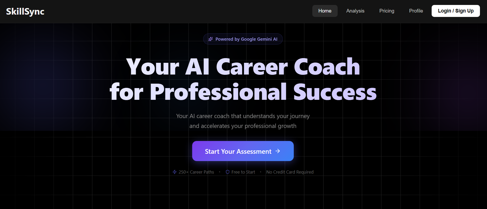
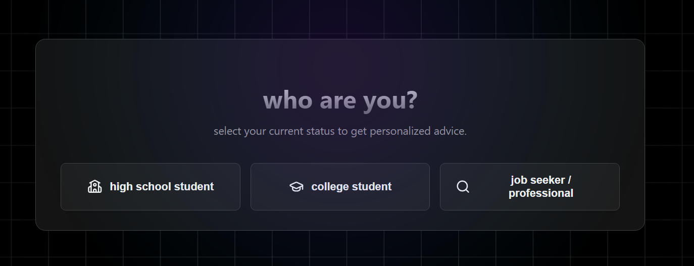

# AI Career Guide - Intelligent Career Roadmap Generator

A modern, AI-powered application that helps users discover their ideal career path based on their skills and interests. Built with React, Vite, Firebase, and Google Gemini AI.

## 🧩 Features

*   **AI-Powered Assessment:** Uses Google Gemini to analyze user skills and interests, providing a personalized career roadmap.
*   **Interactive Career Exploration:** "Chip-based" interface to explore various tech and creative careers.
*   **Detailed Career Insights:** View salary ranges, job outlooks, and required skills for specific roles.
*   **Actionable Plans:** Generates specific project ideas, course recommendations, and certification paths.
*   **Resume Builder:** Integrated tool to help users craft a resume based on their new career path.
*   **Responsive Design:** Fully optimized for desktop and mobile devices.

## 📸 Screenshots

### Device Frames


### Home Screen



### Assessment Screen



## 🛠️ Tech Stack

*   **Frontend:** React 18, Vite
*   **Styling:** CSS3 with CSS Variables (Theming supported)
*   **AI Integration:** Google Gemini API (`@google/generative-ai`)
*   **Backend/Hosting:** Firebase (Hosting, Firestore, Auth)
*   **Icons:** Lucide React

## 📦 Installation & Setup

1.  **Clone the repository:**
    ```bash
    git clone <repository-url>
    cd careerGuide
    ```

2.  **Install dependencies:**
    ```bash
    npm install
    ```

3.  **Environment Configuration:**
    Create a `.env` file in the root directory. You will need API keys for Firebase and Google Gemini.

    ```env
    VITE_GEMINI_API_KEY=your_gemini_api_key_here
    VITE_FIREBASE_API_KEY=your_firebase_api_key_here
    ```

4.  **Run the development server:**
    ```bash
    npm run dev
    ```

## 🎨 Customization

### AI Persona & Prompts
You can customize how the AI responds (its "personality") by editing `src/config/aiPrompts.js`.
*   **Personas:** Modify the `highSchool`, `college`, or `jobSeeker` prompts to change the tone or focus of the advice.
*   **Structure:** The `getBasePromptStructure` function defines the JSON schema expected from the AI.

### Theming
The application uses CSS variables for easy theming. Open `src/index.css` to change the color palette.

**Key Variables:**
*   `--primary-bg`: Main background color.
*   `--accent-primary`: Primary accent color (used for highlights).
*   `--btn-primary`: Primary button color.

## Deployment

This project is configured for **Firebase Hosting**.

1.  **Build the project:**
    ```bash
    npm run build
    ```

2.  **Deploy to Firebase:**
    ```bash
    firebase deploy
    ```

## 📂 Project Structure

```
src/
├── assets/          # Images and static assets
├── components/      # Reusable UI components (Assessment, Profile, etc.)
├── config/          # Configuration files (AI Prompts)
├── data/            # Static data (Skills database, dummy data)
├── firebase/        # Firebase configuration
├── hooks/           # Custom React hooks
├── Modal/           # Modal components
├── Services/        # API services (Gemini AI)
└── ...
```

## 📄 License

Copyright © 2025 Banshal Kumar Yadav. All rights reserved.
